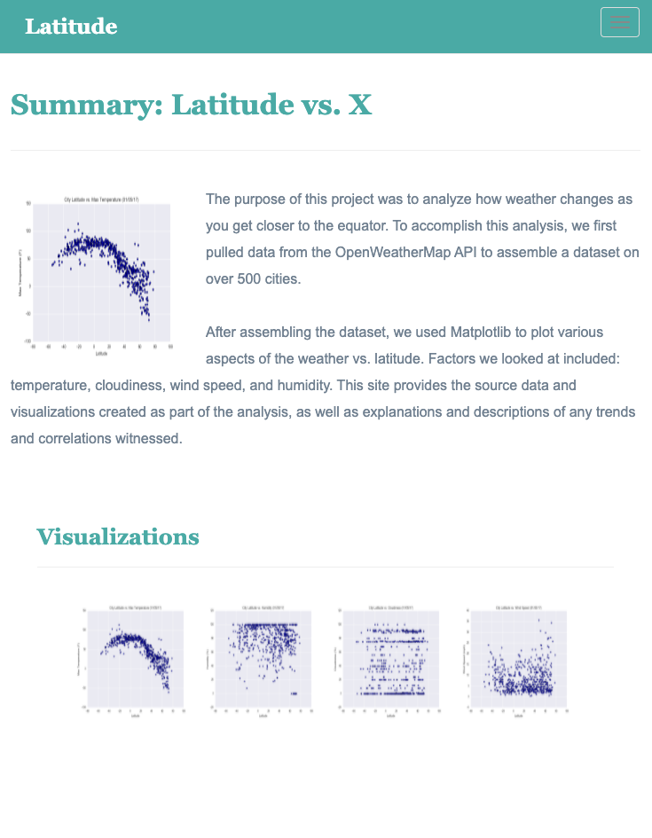
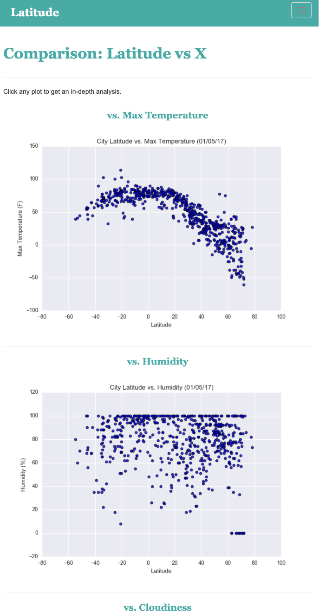

# Web Design - Web Visualization Dashboard (Latitude)

## Background

In building this dashboard, I create individual pages for each plot and a means by which we can navigate between them. These pages will contain the visualizations and their corresponding explanations. I also have a landing page, a page where we can see a comparison of all of the plots, and another page where we can view the data used to build them.

The webpage was build to be displayed in large and small screens suchs as mobile and tablet. The visualizations adjust its pixels accordingly. 

Webpage structure

* A [landing page](#landing-page) containing:
  * An explanation of the project.
  * Links to each visualizations page. 
  
* Four [visualization pages](#visualization-pages), each with:
  * A descriptive title and heading tag.
  * The plot/visualization itself for the selected comparison.
  * A paragraph describing the plot and its significance.
  
* A ["Comparisons" page](#comparisons-page) that:
  * Contains all of the visualizations on the same page so we can easily visually compare them.
  * Uses a Bootstrap grid for the visualizations.

* A ["Data" page](#data-page) that:
  * Displays a responsive table containing the data used in the visualizations.
   

#### Landing page

Large screen:

Small screen:



#### Comparisons page

Large screen:

Small screen:

#### Data page

Large screen:

Small screen:

#### Visualization pages

You'll build four of these, one for each visualization. Here's an example of one:

Large screen:

Small screen:

#### Navigation menu

Large screen:

Small screen:

